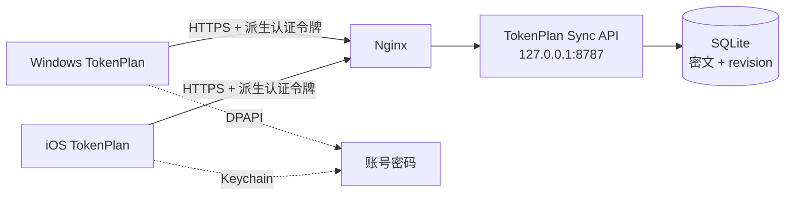

# TokenPlan 云同步与 iOS 实施方案

更新时间：2026-08-29

## 当前实现

Windows 与 iOS 客户端都内置云服务地址，设置页仅显示账号和密码。账号允许 3–64 位字母、数字及 `._-@`，密码要求 16–128 位；生产账号使用随机高熵密码。

客户端使用带用途前缀的 SHA-256 分别派生认证令牌和 256 位 vault 密钥。认证令牌只用于 HTTPS Bearer 认证，vault 密钥只用于本地加密，不会上传服务器。套餐 JSON 使用 XChaCha20-Poly1305、24 字节随机 nonce、`tokenplan-vault-v2` AAD 和 URL-safe Base64 加密。

Windows 用 DPAPI 保存账号密码，iOS 用 `WhenUnlockedThisDeviceOnly` Keychain 保存。服务器只保存密文、随机 nonce、schema version 和递增 revision，看不到套餐 API Key、AK、SK、组织 ID 或项目 ID。

## 同步协议

- `GET /api/v1/vault` 下载当前密文及 revision。
- `PUT /api/v1/vault` 上传密文，并通过 `If-Match` 提交本地 revision。
- revision 不一致时返回 `409 Conflict`，客户端要求先下载，避免离线设备覆盖新数据。
- 认证失败返回 `401`；日志不得记录 Authorization、请求体或第三方 Key。
- Nginx 负责 TLS、限流和请求大小限制；同步服务只监听本机地址。

## 数据迁移与备份

旧版 `tokenplan-vault-v1` 数据迁移时先校验云端明文与本机 DPAPI 数据一致，再以 v2 密钥原样重加密并递增 revision。轮换服务器认证前创建 SQLite 在线备份，旧令牌随后失效。迁移不删除本机套餐或云端记录。

建议服务器每天做 SQLite 在线备份并保留最近 30 天，定期演练恢复。账号密码文件应离线保存；丢失密码时服务器无法解密既有套餐。

## iOS 分发

GitHub Actions 在 macOS runner 上运行 XcodeGen、单元测试和无签名归档，并生成 `TokenPlan-unsigned.ipa`。该文件需要使用个人签名工具重新签名后侧载；Ad Hoc、TestFlight 或 App Store 分发仍需要 Apple Developer 证书和 provisioning profile。

公开提供多用户服务前，应增加独立用户数据库、速率限制、密码重置时的密钥恢复设计、设备撤销和审计记录。当前账号密码方案适合单用户自托管部署。
