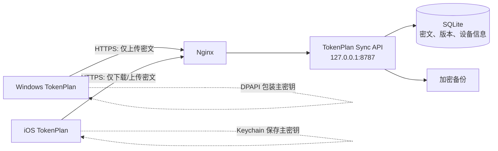

# TokenPlan 云同步与 iOS 实施方案

更新时间：2026-08-28

## 1. 当前状态

- 仓库是 Vue 3 + Tauri 2 + Rust 的 Windows 桌面应用，不包含云端服务。
- 套餐配置保存在 `%APPDATA%/VolcengineTokenPlan/profiles.dat`，整个 JSON 由 Windows DPAPI 加密。
- DPAPI 密文绑定 Windows 用户环境，Linux 云服务器和 iPhone 都无法解密，不能直接同步 `profiles.dat`。
- `tokenplan.xuwenxu.com` 的公网 A 记录已指向 `47.102.119.11`，未发布 AAAA 记录。
- 服务器的 22、80、443 端口可达；SSH 仅接受公钥，当前不能使用密码登录检查 Nginx。
- 项目目前只支持 Windows API（DPAPI、注册表、托盘和桌面窗口），不能直接产出可用的 iOS 应用。

## 2. 推荐架构



云端只负责认证、版本控制和密文存储，不应看到套餐 API Key、AK、SK、组织 ID 或项目 ID 的明文。

### 服务划分

| 组件 | 推荐实现 | 作用 |
| --- | --- | --- |
| 反向代理 | 服务器现有 Nginx | TLS、限流、请求大小限制、安全响应头 |
| 同步 API | Rust + Axum | 复用团队 Rust 能力，提供设备和配置同步接口 |
| 数据库 | SQLite（第一阶段） | 单机和小规模用户足够，便于备份；规模扩大后迁 PostgreSQL |
| 进程管理 | systemd | 非 root 用户运行、自动重启、日志收集 |
| TLS | Let's Encrypt / Certbot | `tokenplan.xuwenxu.com` 自动续期 |

建议云服务只做同步，不在服务器上代用户轮询各套餐供应商。这样第三方 Key 不需要在云端解密，攻击面和合规负担都更小。

## 3. 端到端加密模型

### 3.1 数据密钥

1. 第一台设备生成随机 256 位 `vault_key`。
2. 每次保存配置时，把规范化后的 profiles JSON 用 XChaCha20-Poly1305 加密；每次使用新的随机 nonce。
3. 上传 `{schema_version, revision, nonce, ciphertext}`，服务端不接收明文。
4. Windows 用 DPAPI 保存 `vault_key`；iOS 用 Keychain 保存 `vault_key`。
5. 新设备通过一次性二维码配对传递 `vault_key`。恢复码作为后备方案，不能把主密钥明文存在服务器。

密码学库建议使用 RustCrypto 的 `chacha20poly1305`，不要自创加密格式。附加认证数据应包含用户 ID、vault ID 和 schema version，防止密文被跨账户替换。

### 3.2 认证与设备

第一阶段是单用户或小范围自用时：

- 服务器生成高熵邀请令牌，只用于注册第一台设备。
- 注册成功后给设备签发可撤销的设备令牌；令牌放 Windows DPAPI / iOS Keychain。
- 数据库只保存设备令牌的 Argon2id 哈希。
- 增加设备列表、最后活动时间和撤销能力。

公开给多用户前，应升级为邮箱验证码或 Passkey 登录，并保留独立的端到端加密配对/恢复流程。登录凭据不能充当 `vault_key`。

### 3.3 冲突和删除

- 每个 vault 保存递增 `revision` 和 ETag。
- 更新必须提交 `If-Match`；版本不一致返回 `409 Conflict`，客户端提示选择本地或云端版本。
- 删除使用 tombstone，并保留 30 天以避免离线设备把旧配置重新上传。
- 服务端保留最近 10 个密文版本，用户可回滚；服务端仍无法读取内容。

## 4. API 草案

所有接口只允许 HTTPS，路径统一为 `/api/v1`。

| 方法 | 路径 | 用途 |
| --- | --- | --- |
| `POST` | `/devices/register` | 使用一次性邀请令牌注册设备 |
| `GET` | `/devices` | 查看已注册设备 |
| `DELETE` | `/devices/{id}` | 撤销设备 |
| `GET` | `/vault` | 获取当前密文、revision 和 ETag |
| `PUT` | `/vault` | 携带 `If-Match` 更新密文 |
| `GET` | `/vault/versions` | 获取可回滚版本元数据 |
| `POST` | `/pairings` | 已登录设备创建短时配对码 |
| `POST` | `/pairings/{id}/claim` | 新设备领取端到端加密的密钥包 |
| `GET` | `/healthz` | 本机健康检查，不返回内部信息 |

限制：请求体最大 256 KiB；设备令牌每 IP 每分钟最多 60 次；注册和配对接口限制更严。日志不得记录 Authorization、请求体、密文、恢复码或第三方 Key。

## 5. 服务器部署布局

```text
/opt/tokenplan/bin/tokenplan-sync
/etc/tokenplan/server.env           # 0600，root:tokenplan
/var/lib/tokenplan/tokenplan.db     # 0700，tokenplan 用户
/var/backups/tokenplan/             # 加密备份
/etc/systemd/system/tokenplan-sync.service
/etc/nginx/conf.d/tokenplan.conf
```

服务监听 `127.0.0.1:8787`，绝不能直接监听公网地址。阿里云安全组只开放 22、80、443；SSH 最好再限制管理 IP，禁止 root 密码登录并使用普通 sudo 用户。

Nginx 目标配置：

```nginx
server {
    listen 80;
    server_name tokenplan.xuwenxu.com;
    location /.well-known/acme-challenge/ { root /var/www/certbot; }
    location / { return 301 https://$host$request_uri; }
}

server {
    listen 443 ssl http2;
    server_name tokenplan.xuwenxu.com;

    ssl_certificate /etc/letsencrypt/live/tokenplan.xuwenxu.com/fullchain.pem;
    ssl_certificate_key /etc/letsencrypt/live/tokenplan.xuwenxu.com/privkey.pem;
    client_max_body_size 256k;

    add_header Strict-Transport-Security "max-age=31536000" always;
    add_header X-Content-Type-Options nosniff always;
    add_header Referrer-Policy no-referrer always;

    location /api/ {
        proxy_pass http://127.0.0.1:8787;
        proxy_http_version 1.1;
        proxy_set_header Host $host;
        proxy_set_header X-Real-IP $remote_addr;
        proxy_set_header X-Forwarded-Proto $scheme;
        proxy_read_timeout 15s;
        proxy_connect_timeout 3s;
    }
}
```

正式写入前必须先读取现有 Nginx 配置，确认没有同名 `server_name`，再执行 `nginx -t`，通过后才 reload。

## 6. Windows 客户端改造

不要改掉当前 DPAPI 本地保护；在其上增加独立的同步层：

1. 把配置存储拆成 `ProfileStore`、`VaultCrypto`、`SyncClient` 三个小模块。
2. `ProfileStore` 继续负责本地原子写入和 `.bak`。
3. `VaultCrypto` 只接收/输出字节，不接触 HTTP。
4. `SyncClient` 只传密文，并实现 ETag、超时、重试和冲突提示。
5. 设置页增加“启用云同步、同步状态、立即同步、设备管理、关闭同步”。默认关闭，用户明确启用后才上传。
6. 保存流程为：先成功写本地，再异步上传；云端失败不能导致本地保存失败。
7. 拉取流程为：下载密文、在本机解密和校验、创建本地备份、再原子替换。

首次发布需兼容现有 `profiles.dat`：成功读取旧文件后生成 vault key 和云端密文，但不自动上传，直到用户启用同步。

## 7. iOS / IPA 路线

建议继续使用 Tauri 2，共用 Vue 页面、provider 定义和大部分 Rust 查询代码，但需要平台隔离：

- 给 `windows-sys`、`winreg`、DPAPI、注册表自启动、托盘和桌面窗口代码加 `cfg(target_os = "windows")`。
- iOS 使用 Keychain 保存设备令牌和 `vault_key`，不要使用 WebView localStorage 保存凭据。
- iOS UI 改成正常全屏应用；移除透明悬浮窗、always-on-top、托盘和开机自启概念。
- iOS 后台定时刷新受系统限制。前台启动/下拉刷新时查询即可；如需后台更新，应使用系统 BackgroundTasks，不能承诺固定 60 秒刷新。
- 所有第三方 API 调用继续由 Rust 原生 HTTP 发起，并检查各供应商是否允许移动客户端使用及其 Key 使用条款。
- 先在真机开发构建验证网络、Keychain、同步冲突和锁屏后密钥访问，再做 TestFlight。

构建 IPA 必须使用 macOS、Xcode、Apple Developer Program 的证书和 provisioning profile。推荐顺序：

1. macOS 上执行 `tauri ios init`，完成 bundle identifier、图标和隐私清单。
2. 真机 Debug 验证。
3. Xcode Archive 并上传 TestFlight，先做内部测试。
4. 稳定后再选择 App Store；仅自用时可用已注册设备的 Ad Hoc IPA，但设备和证书有管理成本。

## 8. 实施阶段与验收

### 阶段 A：服务器基础设施

- 获取 SSH 公钥权限，轮换已经通过聊天传递的 root 密码。
- 只读备份现有 Nginx 配置。
- 确认域名 ICP 备案状态。域名/API 指向中国内地服务器时也需要完成 ICP 备案。
- 创建 `tokenplan` 系统用户、systemd 服务、SQLite 目录、TLS 和备份任务。

验收：`https://tokenplan.xuwenxu.com/api/v1/healthz` 返回 200；应用端口不对公网开放；重启服务器后服务自动恢复；证书续期 dry-run 成功。

### 阶段 B：同步服务与 Windows 客户端

- 实现 API、迁移、限流、令牌撤销和并发控制。
- 实现客户端加密、显式启用、保存后同步、拉取和冲突 UI。
- 添加测试：密文篡改、错误密钥、旧配置迁移、409 冲突、服务离线、本地原子写入。

验收：数据库和 HTTP 抓包中都找不到测试 Key 明文；两台 Windows 设备可配对同步；撤销设备后立即无法访问；断网时本地保存正常。

### 阶段 C：iOS

- 平台条件编译、Keychain、移动 UI、前台刷新和配对。
- 真机测试后通过 TestFlight 分发。

验收：Windows 保存后 iPhone 可拉取并解密；iPhone 修改后 Windows 收到新 revision；锁屏、重装、撤销设备和恢复流程符合预期。

## 9. 不建议的做法

- 不上传 DPAPI 的 `profiles.dat` 并期待服务器或 iPhone 解密。
- 不把 Key 写进 `.env` 后提交 Git，也不通过 Nginx 日志记录请求体。
- 不让 Nginx 或同步服务以 root 身份运行。
- 不做“最后写入覆盖一切”的静默同步；它会在离线设备之间丢配置。
- 不直接把服务端口 8787 开放到公网。
- 不在 Windows 机器上尝试制作正式 iOS IPA；最终签名和归档需要 macOS/Xcode。
